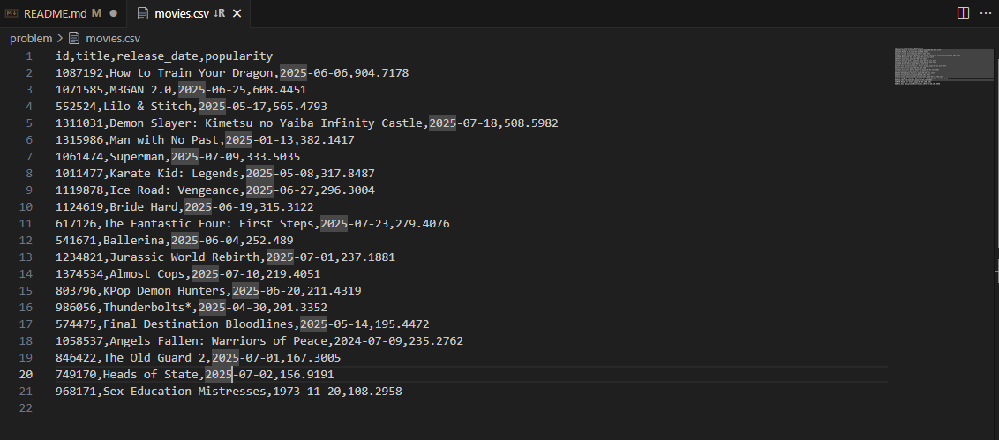
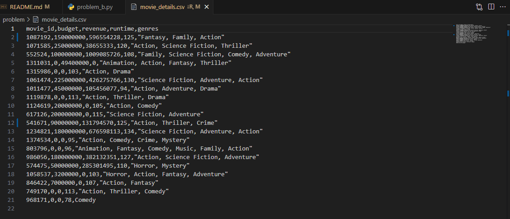
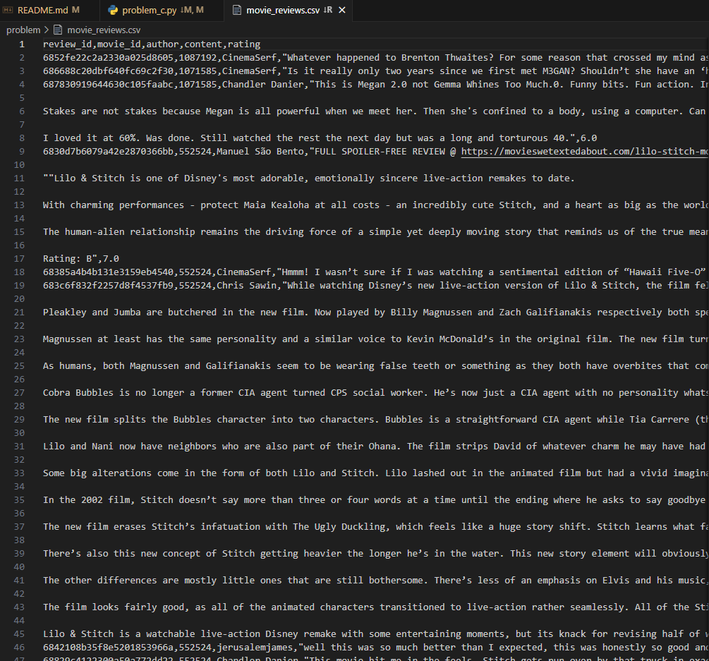
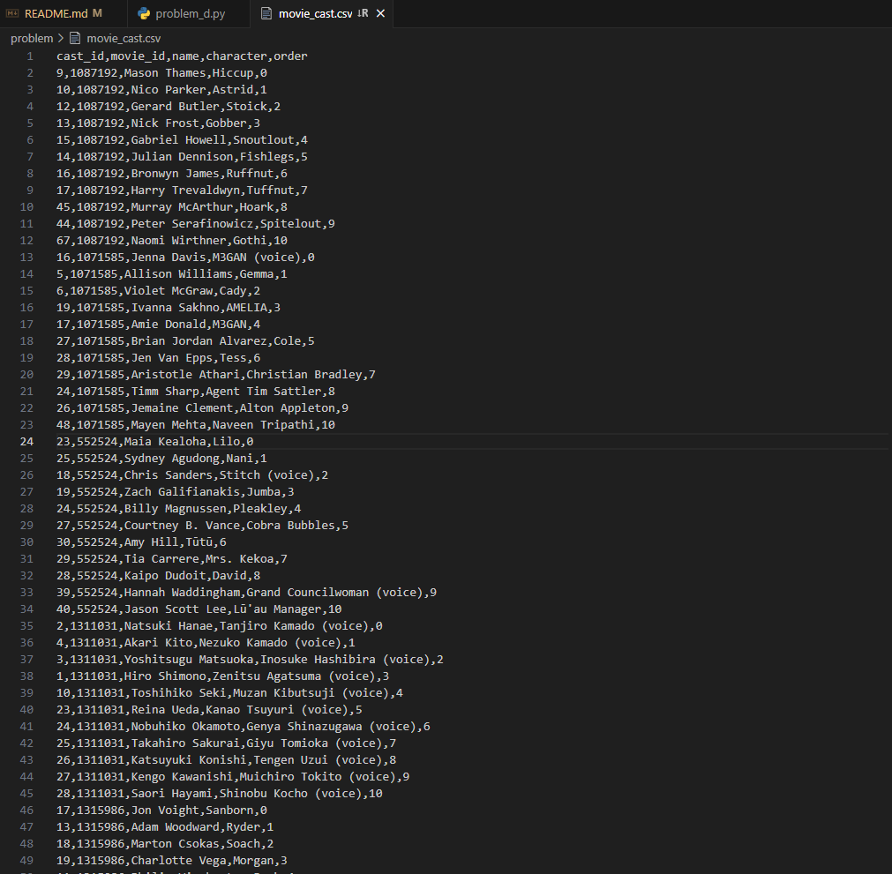
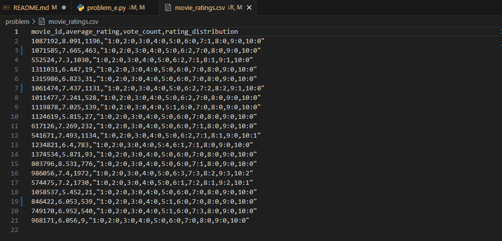

# SSAFY 14기 관통프로젝트

- 프로젝트 명세서와 참고 자료가 업로드 될 저장소입니다.

## 팀 프로젝트 진행 방법

1. 팀원 중 1명은 `{관통 프로젝트 번호}-pjt` 이름의 `gitlab` 원격 저장소를 생성합니다.
  - README.md를 포함하여 생성
2. 함께 작업할 팀원과 `담당 강사`를 `maintainer` 권한을 부여하여 멤버로 초대합니다.
3. 각자의 PC에서 `git clone` 명령어로 내려 받습니다.
4. 각자의 `branch`를 생성하여 맡은 업무를 진행합니다.
  - 작업 중 주기적으로 `Merge Request`를 활용하여 서로의 작업물을 동기화 합니다.
5. 각 작업이 완료되기 전, `README.md`에 프로젝트에 대한 설명과 겪었던 어려운 점, 해결 방법을 상세하게 작성합니다.
6. 당일 18시 이전에 최종 commit을 작성하여 제출합니다.
  - 제출은 생성된 원격 저장소의 `master branch`에 merge 하여야만 인정됩니다.


## 프로젝트에 대한 설명
### 1. problem_a
- 기본 영화 정보 테이블 생성 및 데이터 수집 
  - 인기 있는 영화 목록을 API를 통해 조회하여, 모든 데이터 처리의 
기준이 될 기본 영화 정보를 수집합니다. 각 영화의 고유 ID, 제목, 
개봉일, 그리고 인기도 점수를 추출하여 movies.csv 파일로 저장해야 
합니다. 
```
import requests
import csv

# TMDB API 키 설정
API_KEY = '41ad3f4a63c674f10f1b1a9ada311144'
BASE_URL = 'https://api.themoviedb.org/3'

# API 호출 함수
url = f'{BASE_URL}/movie/popular?api_key={API_KEY}&language=en-US&page=1'
response = requests.get(url).json()

# 영화 데이터 처리 함수
movies = []
for movie in response['results']:
    movies.append({
        'id': movie['id'],
        'title': movie['title'],
        'release_date': movie['release_date'],
        'popularity': movie['popularity']
})

# 데이터 수집 및 CSV 파일로 저장
with open('movies.csv', 'w', newline='', encoding='utf-8') as file:
    writer = csv.DictWriter(file, fieldnames=['id', 'title', 'release_date', 'popularity'])
    writer.writeheader()
    writer.writerows(movies)
```


### 2. problem_b
- 영화 상세 정보 테이블 생성 및 데이터 수집
  - 기본 정보만으로는 서비스에 활용하기 부족하므로, F01에서 수집한 
개별 영화 ID를 바탕으로 각 영화의 상세 정보를 추가로 수집합니다. 
영화의 예산, 수익, 총 상영 시간, 그리고 장르 정보를 추출하여 
movie_details.csv 파일로 저장합니다..
```
import requests
import csv

# TMDB API 키 설정
API_KEY = '41ad3f4a63c674f10f1b1a9ada311144'
BASE_URL = 'https://api.themoviedb.org/3'

# CSV 파일에서 영화 ID 읽기
# # API 호출 함수
# 영화 데이터 처리 함수
movies = []
with open('movies.csv', 'r', encoding='utf-8') as file:
    csv_reader = csv.DictReader(file)
    for row in csv_reader:
        movie_id = row['id']
        url = f'{BASE_URL}/movie/{movie_id}?api_key={API_KEY}&language=en-US&page=1'
        response = requests.get(url).json()
        
        genres = ', '.join([r['name'] for r in response.get('genres')])
        movies.append({
            'movie_id': response.get('id'),
            'budget': response.get('budget'),
            'revenue': response.get('revenue'),
            'runtime': response.get('runtime'),
            'genres': genres
        })

# 데이터 수집 및 CSV 파일로 저장
with open('movie_details.csv', 'w', newline='', encoding='utf-8') as file:
    writer = csv.DictWriter(file, fieldnames=['movie_id', 'budget', 'revenue', 'runtime', 'genres'])
    writer.writeheader()
    writer.writerows(movies)
```



### 3. problem_c
- 영화 리뷰 정보 테이블 생성 및 데이터 수집 
  - 사용자들의 평가를 분석하기 위해 각 영화에 달린 리뷰 데이터를 수집
합니다. 모든 리뷰를 수집하는 것이 아니라, 평점이 5점 이상인 리뷰만 
필터링해야 합니다. 또한, 리뷰 내용이 비어있는 경우 '내용 없음'으로 
처리하는 전처리 과정을 포함하며, 최종 결과를 movie_reviews.csv 파
일로 저장합니다.
```
import requests
import csv

# TMDB API 키 설정
API_KEY = '7394faef83b673f55d39ca81be6ecd61'
BASE_URL = 'https://api.themoviedb.org/3/movie/{movie_id}/reviews'

# 영화 ID 리스트를 movies.csv 파일에서 읽어옴
movie_ids = []

with open('movies.csv', newline='', encoding='utf-8') as csvfile:
    reader = csv.DictReader(csvfile)
    for row in reader:
        movie_ids.append(row['id'])
        
# API 호출 함수
def get_reviews(movie_id):
    url= f"https://api.themoviedb.org/3/movie/{movie_id}/reviews"
    params = {
        'api_key': API_KEY,
        'language': 'en'
    }
    response = requests.get(url, params=params)

    if response.status_code == 200:
        return response.json().get('results', [])
    else: 
        return []

# 리뷰 데이터 처리 함수
def process_review(movie_id, reviews):
    result = []
    for review in reviews:
        content = review.get('content') or '내용 없음'
        rating = review.get('author_details', {}).get('rating', 0)
        if rating is not None and rating >= 5:
            result.append({
                'review_id': review['id'],
                'movie_id': movie_id,
                'author': review['author'],
                'content': content,
                'rating': rating
            })
    return result
    
# 데이터 수집 및 CSV 파일로 저장
all_reviews = []

for movie_id in movie_ids:
    reviews = get_reviews(movie_id)
    filtered = process_review(movie_id, reviews)
    all_reviews.extend(filtered)

with open('movie_reviews.csv', 'w', newline='', encoding='utf-8') as f:
    writer = csv.DictWriter(f, fieldnames=['review_id', 'movie_id', 'author', 'content', 'rating', ])
    writer.writeheader()
    writer.writerows(all_reviews)
```


### 4. problem_d
-  영화 배우 정보 테이블 생성 및 데이터 수집과 전처리 
    - 영화에 출연한 배우와 배역 정보를 수집합니다. 비중 있는 역할을 
파악하기 위해 출연 순서가 10 이하인 배우들만 선택하며 , 데이터에 
포함된 불필요한 줄바꿈 문자를 공백으로 변경하는 등의 데이터 정제 
작업을 수행합니다. 처리된 정보는 movie_cast.csv 파일로 저장합니다.
```
import requests
import csv

# TMDB API 키 설정
API_KEY = '41ad3f4a63c674f10f1b1a9ada311144'
BASE_URL = 'https://api.themoviedb.org/3'

# 문제 a에서 생성된 movies.csv 파일을 기반으로 영화 ID 목록 가져오기
# API 호출 함수
# 배우 데이터 처리 함수
cast_data = []
with open('movies.csv', 'r', encoding='utf-8') as file:
    csv_reader = csv.DictReader(file)
    for row in csv_reader:
        movie_id = row['id']
        url = f'{BASE_URL}/movie/{movie_id}/credits?api_key={API_KEY}&language=en-US&page=1'
        response = requests.get(url).json()
        
        cast_list = response.get('cast', [])
        for cast in cast_list:
            if cast.get('order') <= 10:
                name = cast.get('name', '').replace('\n', ' ').replace('\r', ' ').strip()
                character = cast.get('character', '').replace('\n', ' ').replace('\r', ' ').strip()
                
                cast_data.append({
                    'cast_id': cast.get('cast_id'),
                    'movie_id': movie_id,
                    'name': cast.get('name'),
                    'character': cast.get('character'),
                    'order': cast.get('order')
                })

# 데이터 수집 및 CSV 파일로 저장
with open('movie_cast.csv', 'w', newline='', encoding='utf-8') as file:
    fieldnames = ['cast_id', 'movie_id', 'name', 'character', 'order']
    writer = csv.DictWriter(file, fieldnames=['cast_id', 'movie_id', 'name', 'character', 'order'])
    writer.writeheader()
    writer.writerows(cast_data)
```


### 5. problem_e
- 영화 평점 통계 테이블 생성 및 복합 데이터 수집과 전처리 
    - 여러 데이터 소스를 복합적으로 활용하여 영화의 종합적인 평점 
통계를 생성합니다. API에서는 평균 평점과 총투표 수를 가져오고 , 
F03에서 수집한 movie_reviews.csv 파일을 분석하여 1점에서 
10점까지의 평점 분포를 계산합니다. 이 두 정보를 결합하여 
movie_ratings.csv 파일로 저장합니다.
```
import csv
import requests
from collections import defaultdict

# TMDB API 키
API_KEY = '7394faef83b673f55d39ca81be6ecd61'

# 1. 영화 ID 리스트 불러오기
movie_ids = []
with open('eng_fav_movies.csv', newline='', encoding='utf-8') as csvfile:
    reader = csv.DictReader(csvfile)
    for row in reader:
        movie_ids.append(row['id'])

# 2. 리뷰 파일에서 평점 분포 계산
rating_distributions = defaultdict(lambda: {str(i): 0 for i in range(1, 11)})

with open('movie_reviews.csv', newline='', encoding='utf-8') as csvfile:
    reader = csv.DictReader(csvfile)
    for row in reader:
        movie_id = row['movie_id']
        try:
            rating = int(float(row['rating']))
            if 1 <= rating <= 10:
                rating_distributions[movie_id][str(rating)] += 1
        except:
            continue  # 유효하지 않은 평점 무시

# 3. TMDB API로부터 평균 평점과 투표 수 가져오기
movie_ratings = []

for movie_id in movie_ids:
    url = f"https://api.themoviedb.org/3/movie/{movie_id}"
    params = {
        'api_key': API_KEY,
        'language': 'en-US'
    }
    response = requests.get(url, params=params)

    if response.status_code == 200:
        data = response.json()
        average_rating = data.get('vote_average', 0)
        vote_count = data.get('vote_count', 0)
    else:
        average_rating = 0
        vote_count = 0

    # 평점 분포 문자열 생성 (예: "1:0,2:1,3:5,...,10:2")
    distribution_dict = rating_distributions.get(movie_id, {str(i): 0 for i in range(1, 11)})
    distribution_str = ','.join([f"{k}:{v}" for k, v in distribution_dict.items()])

    movie_ratings.append({
        'movie_id': movie_id,
        'average_rating': average_rating,
        'vote_count': vote_count,
        'rating_distribution': distribution_str
    })

# 4. 결과 CSV로 저장
with open('movie_ratings.csv', 'w', newline='', encoding='utf-8') as f:
    fieldnames = ['movie_id', 'average_rating', 'vote_count', 'rating_distribution']
    writer = csv.DictWriter(f, fieldnames=fieldnames)
    writer.writeheader()
    writer.writerows(movie_ratings)
```


## 겪었던 어려운 점 & 해결 방법
- 개요: TMDB API를 활용한 영화 정보 수집 <br>
[TMDB API](https://developer.themoviedb.org/reference/intro/getting-started)
- 어려웠던 점:
    - Invalid API key 오류 발생: API 요청 시 키를 URL에 잘못 삽입하거나, Authorization 방식과 혼동하여 인증에 실패했다.
    - TMDB API 문서 해석 혼란: {movie_id} 부분에 API 키를 넣는 등 API 경로 구조를 혼동했다.
    - Untracked files 상태: 새로 만든 CSV 파일이 Git에 포함되지 않아 커밋 대상이 되지 않았다.
- 배운 점:
    - git add 명령어로 새로 생성된 CSV 파일들을 Git에 포함시켜 버전 관리가 가능하게 처리.
    - Git에서는 새로 생성된 파일은 반드시 add 명령으로 추적 상태로 전환해야 커밋 가능하다.
    - 작은 실수 하나가 전체 흐름을 막을 수 있기 때문에, 에러 메시지를 정확히 읽고 차근차근 디버깅하는 습관이 중요하다.
---

- 개요: TMDB사이트에서 리뷰를 수집 및 분석 (조건: 평점 5점 이상, 내용이 비어있는 경우 '내용 없음'으로 처리)
- 어려웠던 점: 
    - 리뷰 데이터 중 평점이 없는 경우: 비교 연산 시 에러 발생 가능성이 있음. 
    - csv 파일 읽기/쓰기: csv.DictReader()로 movies.csv 각 행을 딕셔너리로 읽음

---
- 개요: TMDB API와 로컬리뷰데이터를 활용하여 영화별 평균 평점, 투표수, 사용자 평점 분포를 분석하고 csv로 저장하는 프로그램 작성
- 어려웠던 점:
    - 파일 경로 문제: 파일과 코드를 같은 파일 내에 두지 않음. 상대경로에 대한 개념이 부족. 
    - 모듈 설치: pip install requests로 설치해야함
    - 팀원과 git 충돌 발생: commit - push - pull - switch 등의 명령어 순서를 잘 지켜야함. 
    - 미리미리 저장도 해두자...
- 배운 점:
    - 상대경로와 작업 디렉토리 개념은 파이썬 파일 실행 시 정말 중요하다.
    - API를 직접 요청하고 응답받는 실습을 통해 실전 감각을 익혔다.
    - 에러가 발생했을 때 에러 메시지를 정확히 읽고 추적하는 습관이 중요하다는 걸 느낌.
    - 혼자 힘으로 해결 안 될 땐, 질문하고 기록하면서 해결하는 과정 자체도 큰 성장이라는 걸 경험함.
---
- 개요: 협업 시 Git 사용의 중요성을 느끼는 동시에 아직 미숙해서 정말 많은 실수를 만들었다.
- 어려웠던 점: branch에서 진행한 작업을 push해야 할 레포지토리(이선영/01-pjt)가 아니라 clone을 받은 레포지토리 (SSAFY 14기/대전4반/Project)에 올렸다. 
- 배운 점:
    - git clone https://lab.ssafy.com/zlzlakfls/01-pjt.git
    - cd 01-pjt (필요한 파일은 현재의 폴더로 복사해오기)
    - git branch -c eunsu
    - git switch eunsu
    - git add .
    - git commit -m "initial commit"
    - git push origin eunsu
    - (merge request)
---